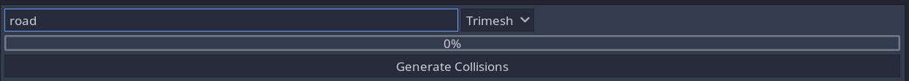

# mesh-collision-helper
Simple plugin to help generate collision from meshes.

## Installation

To use this plugin, follow these steps:

1. Copy the **mesh-collision-helper** folder into your Godot project's addons folder.
2. In the Godot editor, open the Project Settings and go to the Plugins tab.
3. Find this plugin in the list and click the "Enable" checkbox.

## How to use it

You can use it if you have a scene with a lot of meshes and you need to generate collisions from them.
Meshes should contain some substring in the name. For example, all walls may have **wall** in the name.

1. To use this plugin, you need to select one node in the scene that have mesh instances as children. Meshes can be located at any level in the hierarchy under the selected node, as the search will be recursive.
2. Open the plugin's user interface by clicking on the "Generate Collisions" button in the bottom panel of the Godot editor.
3. In the user interface, enter a search string in the text field to filter the nodes by name. Only nodes whose names contain the search string will be processed.
4. Choose the type of collision to generate from the dropdown menu. The options are "Trimesh", "Convex", and "Multiple Convex".
5. Click the "Generate Collisions" button to start the process.
6. The plugin will generate collisions for all matching nodes and update the progress bar in the user interface. When the process is complete, the user interface will display a message "Done".

